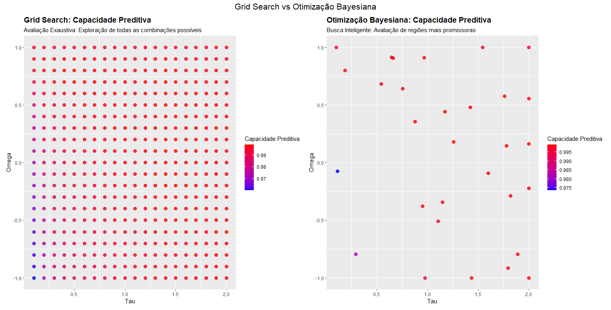

# Definição dos Pesos (weights) da Matriz H na análise GBLUP de etapa única (Single-Step Genomic BLUP): 
## Uma Abordagem com Grid Search e Otimização Bayesiana 

Na análise GBLUP de etapa única, aplicada à seleção genômica, um dos desafios é definir os parâmetros τ (tau) e ω (omega). Esses parâmetros controlam a contribuição das matrizes genômicas G e de pedigree A na construção da matriz H, influenciando diretamente a precisão das predições. No entanto, a escolha adequada desses pesos é complexa devido à sensibilidade dos parâmetros, ao custo computacional e ao risco de super ou subestimação das predições.

Para lidar com esse problema, explorei duas abordagens distintas para determinar os valores mais adequados para τ e ω: `Grid Search` e `Otimização Bayesiana`. O objetivo é melhorar a precisão das predições no HBLUP, garantindo um ajuste eficiente da matriz H.

## Abordagens Utilizadas 📊💻

### 1. Grid Search (𝗯𝘂𝘀𝗰𝗮 𝗲𝘅𝗮𝘂𝘀𝘁𝗶𝘃𝗮) 🗺️
O `Grid Search` consiste em testar todas as combinações possíveis de τ e ω dentro de uma grade predefinida de valores. As principais características desse método são:

- **Busca exaustiva**: Garante que todas as combinações de parâmetros dentro da grade sejam avaliadas, proporcionando uma visão completa do espaço de parâmetros.
- **Facilidade de implementação**: Simples de configurar e interpretar, sendo uma abordagem direta para explorar o impacto de τ e ω.
- **Alto custo computacional**: Pode ser inviável se a grade for muito grande, pois exige a avaliação de um grande número de modelos.

### 2. Otimização Bayesiana (𝗽𝗿𝗼𝗰𝗲𝘀𝘀𝗼 𝗶𝘁𝗲𝗿𝗮𝘁𝗶𝘃𝗼) 🔄
A `Otimização Bayesiana` adota uma abordagem iterativa e inteligente para encontrar os melhores valores de τ e ω. Inicialmente, alguns pontos são avaliados aleatoriamente, e com base nos resultados obtidos, um modelo probabilístico é ajustado para prever quais regiões do espaço de busca são mais promissoras. Esse processo se repete, sempre priorizando áreas com maior potencial de melhoria. Suas características incluem:

- **Busca inteligente**: Usa um modelo probabilístico para explorar o espaço de parâmetros de forma inteligente, focando nas regiões mais promissoras.
- **Eficiência computacional**: Reduz o número de combinações testadas, economizando tempo e recursos.
- **Complexidade maior**: Requer um modelo de surrogate (como processos gaussianos) para guiar a busca.

## Critérios de Avaliação 🎯
Para comparar as duas abordagens, utilizei os seguintes critérios:

- **Capacidade Preditiva**: Correlação entre fenótipos observados e valores preditos.
- **Inflação**: Inclinação da regressão dos fenótipos observados em relação aos valores preditos.
- **Erro Quadrático Médio (MSE)**: Mede a qualidade da predição; quanto menor o MSE, melhor o modelo.

## Comparação e Resultados 🚀📈
Nos experimentos realizados, o `Grid Search` forneceu uma visão completa do impacto dos parâmetros τ e ω, permitindo entender melhor seu comportamento. No entanto, a `Otimização Bayesiana` demonstrou ser uma alternativa mais eficiente, encontrando bons valores para os parâmetros com menos avaliações.

  

Os gráficos gerados mostram que:

- No **Grid Search**, os pontos são distribuídos uniformemente, cobrindo toda a grade de parâmetros.
- Na **Otimização Bayesiana**, os pontos testados são mais dispersos no início, mas rapidamente se concentram nas regiões mais promissoras.

Essa comparação demonstra que ambas as abordagens têm suas vantagens e podem ser usadas em conjunto para melhorar a definição dos pesos na matriz H. 

# Pacotes R Utilizados 🛠️🔍
Para implementar as análises de **Grid Search** e **Otimização Bayesiana**, foram utilizados pacotes específicos do R que facilitam o cálculo da matriz H, a ajustagem de modelos mistos e a otimização de parâmetros. 

- O pacote `AGHmatrix` foi empregado para calcular as matrizes de parentesco genômico (G) e de pedigree (A), bem como para construir a matriz híbrida H com os parâmetros τ e ω. https://doi.org/10.32614/CRAN.package.AGHmatrix 
- Para ajustar os modelos mistos, utilizou-se o pacote `sommer`, que permite a inclusão de estruturas complexas de variância e covariância. https://doi.org/10.32614/CRAN.package.sommer 
- Já a otimização bayesiana foi realizada com o pacote `rBayesianOptimization`, que implementa uma abordagem eficiente para explorar o espaço de parâmetros. https://doi.org/10.32614/CRAN.package.rBayesianOptimization 
- Além disso, o pacote `dplyr` foi utilizado para manipulação de dados e o `ggplot2` para a visualização dos resultados.

# Para quem quiser explorar mais afundo os efeito dos parâmetros τ e ω na construção da matriz H, recomento esse estudo: 
MARTINI, Johannes WR et al. The effect of the H−1 scaling factors τ and ω on the structure of H in the single-step procedure. Genetics Selection Evolution, v. 50, n. 1, p. 16, 2018. https://doi.org/10.1186/s12711-018-0386-x. 
